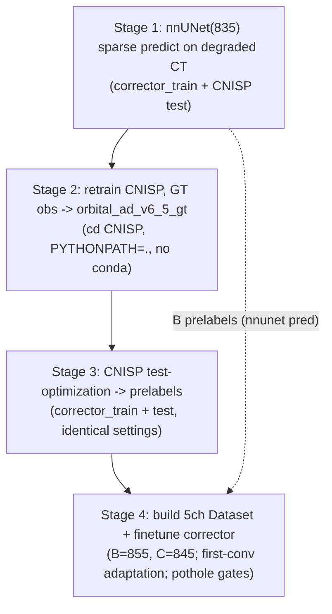
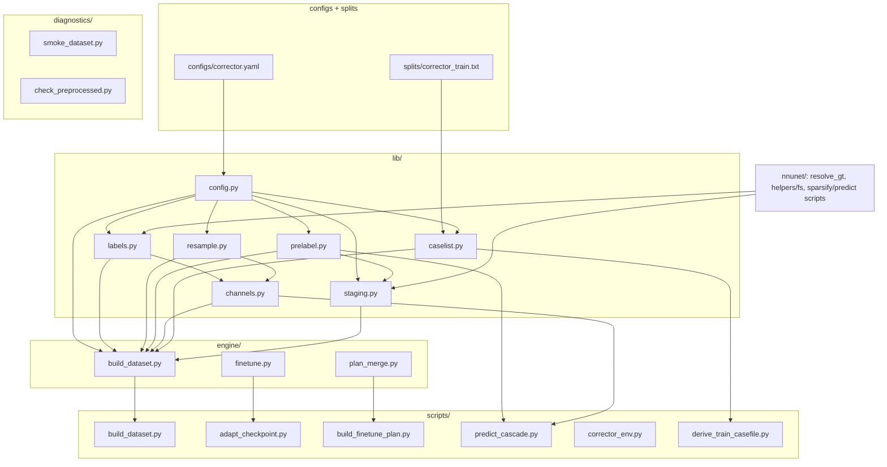

# nnUNet-C "corrector" experiment

Does the **CNISP shape prior** give a second-stage segmenter information that
**re-running nnUNet cannot**? This package builds and finetunes the three
controls that answer it, from one config-switchable codebase.

## Controls (A/B/C)

| Control | Dataset | ch0 | ch1..ch4 (prelabel) | Role |
|---------|---------|-----|---------------------|------|
| A. Pure nnUNet      | **835** (existing) | degraded CT | — (1 channel) | bottom baseline; already trained |
| B. Stacked nnUNet   | **855** | degraded CT | nnUNet one-round prediction (binaries) | standard stacked baseline (no CNISP) |
| C. CNISP-conditioned| **845** | degraded CT | CNISP prediction (binaries) | our method |

B and C are **structurally identical** 5-channel datasets; the only difference is
whether ch1..ch4 come from a second nnUNet pass (B) or CNISP (C). **C vs B** is
the key comparison. Both finetune from the same Dataset835 weights via first-conv
channel adaptation. A is the existing 835 model (no build/train).

- ch0 is **pinned to the degraded/thick CT** (`input/{exp}/sparse_step_XX/`); the
  builder refuses a native/dense CT so the corrector cannot read the answer off a
  sharp image.
- ch1..ch4 = one **binary** channel per `{ON, Recti, Globe, Fat}`; nnUNet
  normalization `noNorm` (not z-scored); ch0 = `CT`.
- B's prelabel and C's CNISP input trace back to **one** nnUNet prediction per
  `(source, step)` (fair comparison).

## 4-stage pipeline (`run_full_pipeline.sh`)



| Stage | Action | Key products |
|-------|--------|--------------|
| 1 | `prepare_inputs` -> `synth_train_sweep` -> `sparsify_inputs` -> `predict_sparse_iso` -> `build_dataset835_sparse_patches` | degraded CTs; nnUNet sparse(+native) preds (= B prelabels); canonical patches (= Stage-3 input) |
| 2 | cross-folder `run_02_train.sh train_v6_5_gt.yaml` | `${model_basedir}/orbital_ad_v6_5_gt/best_checkpoint.pth` |
| 3 | `gen_prelabels.sh` = `03_infer.py` x2 (only `--test-casefile` differs) | `runs/{exp}/{run_tag}/native_space_step_XX/*_cnisp_stepXX.nii.gz` (= C prelabels) |
| 4 | per control: `build_dataset` -> plan/preprocess -> `build_finetune_plan` -> preprocess -> **GATE** -> `adapt_checkpoint` -> `nnUNetv2_train` | finetuned `Dataset855/845` |

```bash
# fill the corrector training split first (source_ids, one per line):
#   nnunet-c/splits/corrector_train.txt
bash nnunet-c/run_full_pipeline.sh            # all stages
bash nnunet-c/run_full_pipeline.sh 4          # only Stage 4
FORCE=1 CONTROLS="C" bash nnunet-c/run_full_pipeline.sh 3 4
```

## Module dependency graph



Reused from the existing repo: `nnunet/data_prep/resolve_gt.py` (label schemes),
`nnunet/helpers/fs.py` (softlinks), and the Stage-1 sparse-sweep scripts.

## Potholes (GPU-box preprocess verification)

855/845 recompute their own fingerprint; the 835 weights we finetune were trained
under 835's fingerprint. These are addressed automatically inside `run_train.sh`:

1. **CT normalization** — `build_finetune_plan.py` overrides ch0
   `foreground_intensity_properties_per_channel["0"]` to equal 835.
2. **Binary channels vs spline resampling** — resolved by **(a-ii)**: the builder
   resamples every channel + label to the **835 plan spacing** (`lib/resample.py`),
   so nnUNet's preprocess resample is a no-op and ch1..ch4 stay `{0,1}` (ch0
   order 3, masks/label order 0).
3. **Target spacing** — `build_finetune_plan.py` overrides the 855/845 plan
   spacing + architecture to equal 835.
4. **Spot check (HARD GATE)** — `diagnostics/check_preprocessed.py` verifies CT
   range vs 835, binary ch1..ch4, identical shapes, labels `{0..4}`; finetune does
   not start unless it passes.

`build_finetune_plan.py` dumps `plan_before.json` / `plan_after.json` for diffing;
plans are never hand-edited.

## Reproducibility contract (prelabels, Stage 3)

CNISP is an AutoDecoder: new-case prediction = test-time latent optimization. The
corrector_train and test prelabels are produced by the **same** `03_infer.py`
invocation settings (`orbital_shape_prior_st1/configs/test_corrector.yaml`),
changing **only** `--test-casefile`:

- checkpoint: `best` of `orbital_ad_v6_5_gt`
- `--test-label-source nnunet_pred` (test-time observation = nnUNet pred on the
  degraded image; no GT at test)
- `--experiment thick`, `--run-tag corrector_gt`
- `latent_num_iters: 3000`, `latent_lr: 1e-2`, **hard** target
  (`latent_fit_soft: false`), `start_offsets: [0]`, `save_mask_source_ids: null`

## Splits & leakage guarantees

- `splits/corrector_train.txt` — corrector training `source_id`s (one per line).
- CNISP `train/val/test` come from `casefiles_dir`; **all controls' test = CNISP
  `test_cases.txt`**.
- `lib/caselist.py` aborts if `corrector_train ∩ CNISP_train` or
  `corrector_train ∩ CNISP_test` is non-empty (patient/source_id level).

## Test prediction & evaluation (A/B/C)

The trained corrector is predicted on the **CNISP `test_cases.txt`** set (real GT),
reusing the test cases' degraded CTs + 835 sparse preds + aligned patches from the
earlier sweep.

```bash
# C (runs CNISP test inference, assembles 5ch, predicts, evals):
GPUS="0 1" CHK=checkpoint_best.pth bash nnunet-c/run_corrector_predict.sh C 0
# B (no CNISP step):
RUN_CNISP=0 bash nnunet-c/run_corrector_predict.sh B 0
```

Stages: CNISP test inference (**existing `032`/`run_corrector_cnisp.sh`**, dense
**native** output — same as training, no literal iso-0.5 decode) → `scripts/build_corrector_testset.py`
assembles `test_input/<name>/imagesTs` → `nnUNetv2_predict -chk checkpoint_best.pth`
→ `diagnostics/eval_corrector.py`.

- **Test assembly = training assembly.** `build_corrector_testset.py` reuses the
  exact same `channels.assemble_inference_case` → `split_mask_to_binaries`, with
  channel order **pinned `[ON, Recti, Globe, Fat]`** identical to training. No
  separate split logic; ch0 is upsampled to the mask grid; ch1..ch4 are binaries.

### Eval grid & resample direction (correctness + fairness)

- **Prediction grid:** `nnUNetv2_predict` exports in the **input `imagesTs`
  geometry**, which we built on each source's **original/dense grid (= the native
  GT grid)**. So predictions already land on the GT grid (for A, the stock 835
  native pred is likewise on the native grid).
- **Pinned resample direction:** eval resamples the **prediction → each source's
  native GT grid with order 0** (nearest, stays discrete); the **GT is never
  moved**. Dice is computed on the native GT grid. (For B/C this is a safety
  no-op; the direction is pinned regardless so all controls are scored on
  identical voxel grids.)
- **One eval for A/B/C.** `diagnostics/eval_corrector.py` is the *single* code
  path; only the prediction differs across controls. The `test_cases_map.json`
  (written by the assembler) carries each case's `gt_label_path` +
  `gt_struct_to_value`, so GT→`{1,2,3,4}` remap and the resample are byte-identical
  across controls — this is what makes the **B-vs-C Dice gap trustworthy**.

```bash
# any control, same script:
python nnunet-c/diagnostics/eval_corrector.py \
    --map nnunet-c/test_input/PHOTON_CT_CORR_C_cnisp/test_cases_map.json \
    --pred-dir nnunet-c/predictions/PHOTON_CT_CORR_C_cnisp/fold_0 \
    --out-csv nnunet-c/predictions/eval_C.csv
# A baseline: build its map (no image assembly), pred paths are absolute:
python nnunet-c/scripts/build_corrector_testset.py --control A
python nnunet-c/diagnostics/eval_corrector.py \
    --map nnunet-c/test_input/PHOTON_CT_QAfiltered/test_cases_map.json \
    --out-csv nnunet-c/predictions/eval_A.csv
```

## Environment

- `nnunetv2` (training/preprocess/predict) + `$nnUNet_raw`, `$nnUNet_preprocessed`,
  `$nnUNet_results` are required on the GPU box. The Python modules here depend
  only on numpy/nibabel/torch/yaml and run anywhere.
- **Confirm on the GPU box**: the real 835 plan folder name (`nnUNetPlans` vs
  `nnUNetPlans_iso05`) — set it as `reference_plan` in `configs/corrector.yaml`.
- Dataset/CNISP-model names are all in `configs/corrector.yaml`
  (855/845 names, `orbital_ad_v6_5_gt`, `run_tag`).

## Per-component entry points

| Need | Command |
|------|---------|
| Build a control's raw dataset | `bash run_build_dataset.sh B` |
| Adapt 835 ckpt 1ch->5ch | `python scripts/adapt_checkpoint.py --in ... --out ... --channels 5` |
| Merge finetune plan | `python scripts/build_finetune_plan.py --control B` |
| Preprocess gate | `python diagnostics/check_preprocessed.py --control B` |
| Finetune one control | `bash run_train.sh B 0` |
| CNISP prelabels | `bash scripts/gen_prelabels.sh both` |
| Test predict + eval (CNISP test set) | `bash run_corrector_predict.sh C 0` |
| Assemble test 5ch inputs only | `python scripts/build_corrector_testset.py --control C` |
| Eval predictions (A/B/C, shared) | `python diagnostics/eval_corrector.py --map ... --pred-dir ...` |
| Raw smoke test | `python diagnostics/smoke_dataset.py --control B` |
